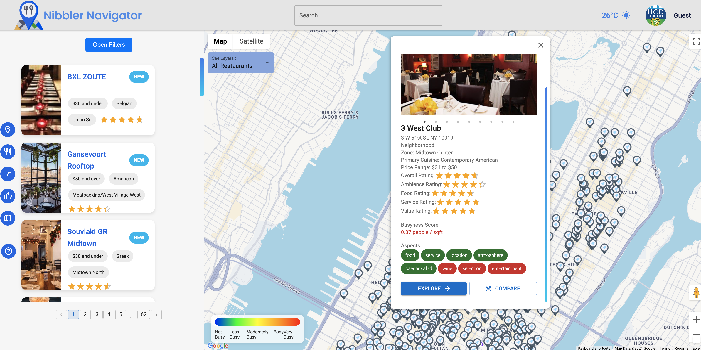

<!-- Project icon or logo -->

<!-- Project title -->
<h1 align="center" style="font-weight: bold; margin-top: 20px; margin-bottom: 20px;">Nibbler</h1>

<!-- Short description of the project (one line max) -->

<!-- Badges with meaningful information about the project (e.g. build status, code quality, etc)
    Do not use too many badges, or include information that is already visible -->
[![Status][status-badge]][status-link]
[![Release][release-badge]][release-link]
[![License][mit-license-badge]][mit-license-link]

<!-- Quick links to the main sections of the README
    Do not include anything already visible on the page -->

  <a href="#development">Development</a> •
  <a href="#screenshots">Screenshots</a> •
  <a href="#features">Features</a> •
  <a href="#authors">Authors</a>

## Overview

> Nibbler is a Manhattan based personalised restaurant recommendation service. Using the latest in machine learning and AI, it provides users with recommendations based on the busyness of the area, the user's preferences, and an AI-powered analysis of the reviews to reveal how the restaurant is truly perceived.

## Vision

The aim of this project is to provide users with more than just the traditional list of restaurants and ratings. At present, users in Manhattan are overwhelmed with the number of restaurant options available to them and are unsure of the quality, atmosphere, and busyness of the restaurants they are considering. Additionally, it is difficult for users to trust the marketing material provided by the restaurants, the generic recommendations provided by other services, and the handful of reviews they have time to read. Nibbler seeks to address these issues by providing users with personalised recommendations based on their preferences, sentiment analysis of the reviews, and an ML-powered prediction of the busyness of the area.

Through Nibbler, users will be able to make informed decisions about where to eat using real insights from the people who have been there, and personalised recommendations that take into account their preferences, without the need to read through hundreds of reviews or rely on marketing material.

## Development

To start developing the project, see the [development workflow][development-workflow-link].

## Screenshots

## Features

-**Welcome Page:** A landing page welcoming users to the website with a minimalistic
design

-**About Us** This page lists out the team members contributing to the overall completion of the application

-**Contact Us** This page contains a contact-us form where the user can insert his details along with the message he wishes to deliver to the team.

-**Sign in** This functionality allows the user to sign in to the website and use user-authenticated routes.

-**Sign Up** This feature allows the user to signup with basic information alongside adding preferences for the recommender system (not fully imple-
mented)

-**Reset Password** Allows existing users to reset their passwords in case they forgot it.

-**Tour Guide** This feature was added to address the issue of intuitiveness with a very interactive step-by-step walkthrough of the website.

-**Restaurant Card** This is one of the website’s core features where it displays a list of restaurants in card format that can be flipped 180 degrees around the Y-axis. The front of the card displays a picture, cuisine type, location, and rating, while the back of the card displays extra information such as aspects, an icon to the website’s address, and a favorites button where you can add your liked restaurants.

-**Pagination** The cards are loaded through pagination techniques which reduces the fetching time for the restaurants.

-**Filters** This is also considered a core feature where you can filter the desired restaurants by price, zone, cuisine, overall rating, food rating, aspects,and more. A reset option is also provided.

-**Layers** The website has two layers that can be shown on the map: the marker layer and the busyness layer.

-**Markers** We leveraged the use of advanced markers to display the locations of different restaurants on the map.

-**Info Window** A pop-up window displaying detailed information about the restaurant including an image slider, different types of rating, busyness score, comparison feature, and more.

-**Geojson Layer** This option displays the different zones in Manhattan and visualizes the busyness in those areas using four color shades with an indicator in the bottom left of the map to understand their meaning.

-**Map Style** A unique map style that fits with the presentation of the website.

-**Street view** Allowed the integration of street view within our project to make it even simpler and easier for users.

-**Weather Integration** Simple weather gadget that displays the temperature alongside an icon representing current weather conditions.

-**Search bar** A search bar that can look up restaurants.

-**Regions** The regions icon where a user can list out different restaurants depending on the region/zone they want.

-**Restaurants** The restaurants icon where a user can search and find out any restaurants they want in card format.

-**Comparison** The user can compare any two restaurants from the Info Window by
clicking on the compare button which then gets added to compare. A
notification alert arises when a restaurant is added.

-**Charts** The chart showcases different areas of Manhattan with a busyness score presented as a chart.

-**User Management** The user can use this feature to change his name, surname, and avata

## Authors

- [Emma Nolan](https://github.com/emma-nolan)
- [Riin Kaljurand](https://github.com/RiinKal)
- [Han Zheng](https://github.com/chugalugzzz)
- [Carlo Finnegan](https://github.com/Carlofinnegan)
- [Emad Nazzal](https://github.com/emadNazzal)

## Contributors

- [Baris Degirmencioglu](https://github.com/Xelee)

<!-- Links -->
[development-workflow-link]: docs/Development%20Workflow/Development%20Workflow.md
[mit-license-badge]: https://img.shields.io/badge/license-MIT-b7bdf8?style=for-the-badge&logoColor=cad3f5&labelColor=363a4f&color=b7bdf8
[mit-license-link]: LICENSE
[release-badge]: https://img.shields.io/badge/release-unreleased-f5a97f?style=for-the-badge&labelColor=363a4f&color=f5a97f
[release-link]: RELEASE-LINK
[status-badge]: https://img.shields.io/badge/status-active-a6da95?style=for-the-badge&labelColor=363a4f&color=a6da95
[status-link]: STATUS-LINK
[documentation-link]: DOCUMENTATION-LINK
